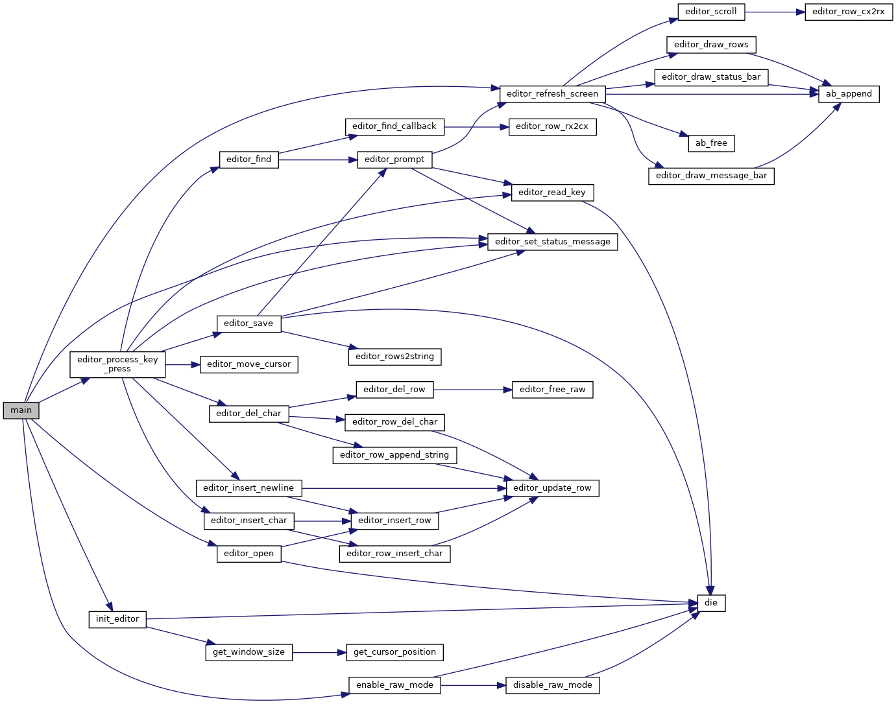

# kilo editor
https://viewsourcecode.org/snaptoken/kilo/index.html

## Installation
`git clone https://github.com/yutljp/kilo.git`

`cd kilo`

`make`

`make install`

## Function call dependent graph

## Usage
Create or edit text files.  
`kilo` or `kilo filename`

Create or edit binary files.  
`kilo -b` or `kilo -b filename`
